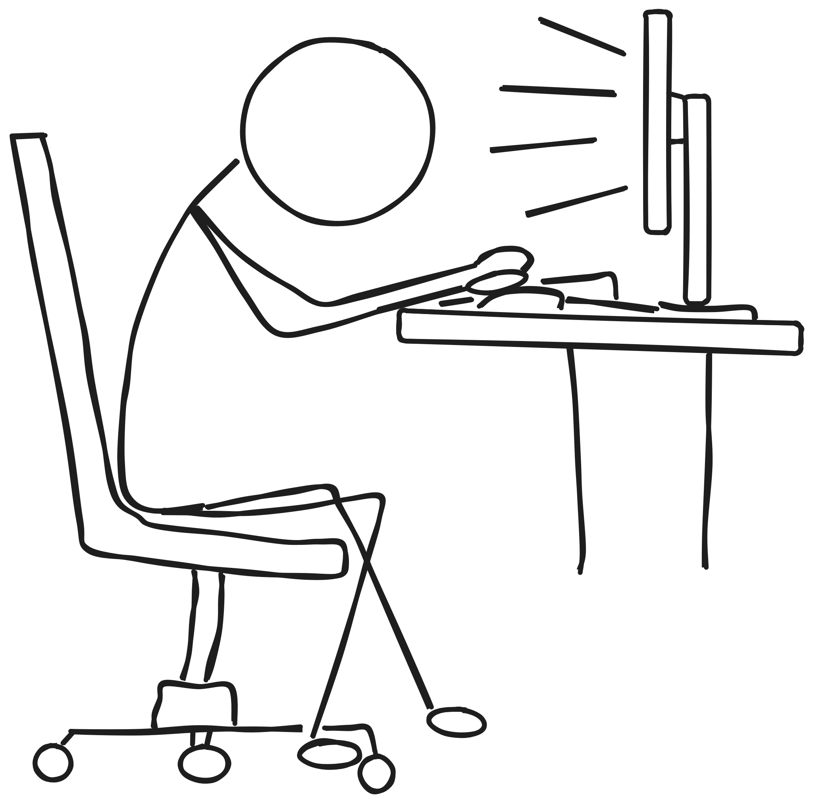

  <picture>
    <source srcset="aref-dark.png" media="(prefers-color-scheme: dark)">
    
  </picture>

  
  
  
  
  
  

---

## about

I like starting projects I never finish. Nobara Linux + Niri + Neovim. Go, Rust, C, Python.

**Links:** [GitHub](https://github.com/ArefDagmash) · [LinkedIn](https://www.linkedin.com/in/arefdogmosh) · [Email](mailto:arefdagmash@gmail.com)

---

