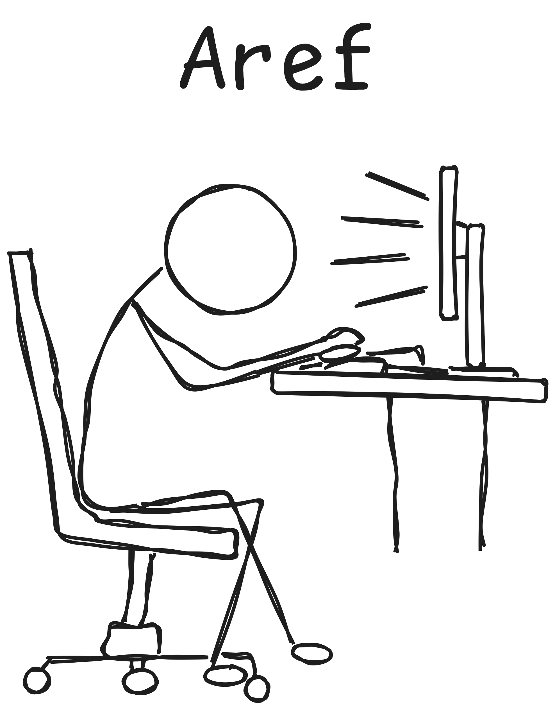
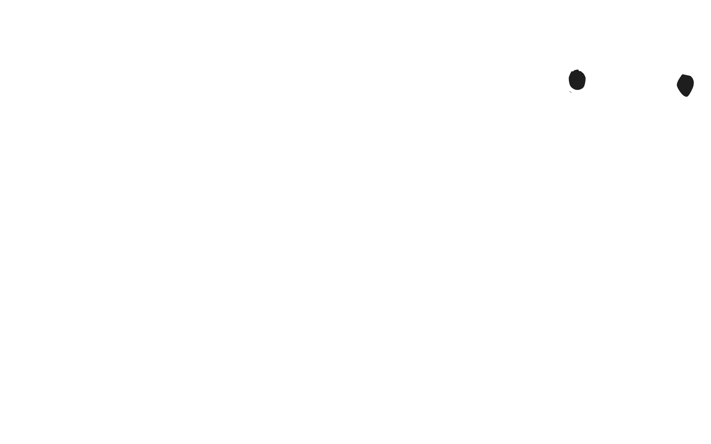

  

  

  
  
  
  
  
  

---

## whoami

I'm **Aref**, a CS student at **AUS** graduating Spring 2026. I build **backend systems** and mess with **low-level stuff** — currently rebuilding HTTP from TCP, no libraries, no shortcuts.

- **Daily driver:** Nobara Linux + Niri (Wayland) + Neovim
- **Currently:** Learning eBPF, async runtimes, distributed systems
- **Philosophy:** Understand it from the metal up, or don't build it

---

## stack

**Languages I actually use:**
- Go — systems, networking, tooling
- Rust — when I need it fast and safe
- C — when I need to know exactly what's happening
- Python — scripting, automation, quick prototypes
- Java — enterprise backend

**Environment:**
- Linux (Nobara / Niri) | Fish shell | Neovim + custom config
- Building: CLI tools, backend services, network protocols
- Learning: eBPF, async runtimes, distributed systems

---

## what i'm up to

**Projects & learning:**
- Rebuilding HTTP from TCP (from scratch, zero dependencies)
- Building CLI tools that touch the network stack
- Maintaining a fully custom Linux dev environment
- Contributing to open source when I can

**This week:**
- Probably coding until 3 AM and drinking too much coffee

---

## connect

Got questions about systems, backend, or just want to chat? Hit me up.

- **GitHub:** [@ArefDagmash](https://github.com/ArefDagmash)
- **LinkedIn:** [arefdogmosh](https://www.linkedin.com/in/arefdogmosh)
- **Email:** [arefdagmash@gmail.com](mailto:arefdagmash@gmail.com)

Open to opportunities, collaborations, or random questions about systems.

---

## contributions

The only contribution graph that matters.

  

<picture>
  <source media="(prefers-color-scheme: dark)" srcset="https://raw.githubusercontent.com/ArefDagmash/ArefDagmash/output/github-contribution-grid-snake-dark.svg" />
  <source media="(prefers-color-scheme: light)" srcset="https://raw.githubusercontent.com/ArefDagmash/ArefDagmash/output/github-contribution-grid-snake.svg" />
  
</picture>

---

## stats

  
  

  

---

> *"The only way to do great work is to love what you do."* — not me, but it hits

*(yes, the stickman is hand-drawn by me. no, i'm not an artist.)*
